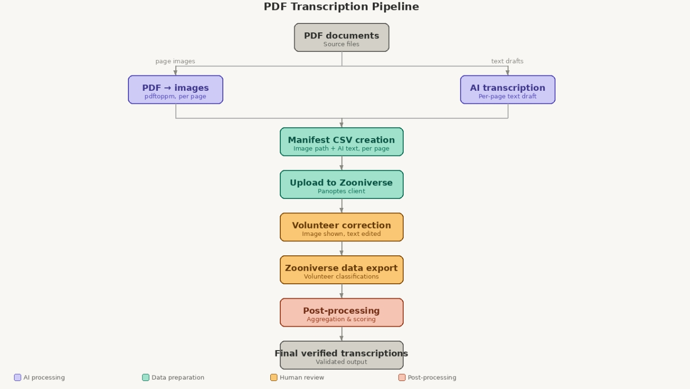

# Civil War Pension Files — Transcription Workflow
## How the System Works

This document explains how we will set up Zooniverse on a high level. See [initial_design_doc.md](initial_design_doc.md) for more details.

## The Five Stages

Pipeline Overview


### Stage 1 — Converting the PDFs into Images

Before anything can be transcribed, each page of each PDF needs to become its own image file. We do this because Zooniverse only accepts images as inputs. 

A command-line tool called **pdftoppm** reads a PDF and saves every page as a PNG image at high resolution (300 DPI — clear enough to read handwriting). This happens automatically for all 200 PDFs in one batch.

Each image is named after its source file and page number:

```
Robinson_Lucius-1.png   (page 1 of Robinson_Lucius.pdf)
Robinson_Lucius-2.png   (page 2)
...
```

At the end of this stage there will be roughly 30,000 image files, organised into folders by person.

> **One thing to note:** Zooniverse (the platform used in Stage 3) has a strict 1 MB file size limit per image. PNG files at 300 DPI are typically 3–8 MB each, so they need to be converted to JPEG and lightly compressed before upload. This is handled automatically in the pipeline and does not affect readability.


### Stage 2 — Getting AI transcribed files

Using DARE, we will get a series of text files:

```
Robinson_Lucius-1.txt   (AI draft for page 1)
Robinson_Lucius-2.txt   (AI draft for page 2)
...
```


### Stage 3 — Uploading to Zooniverse

Before uploading, a **manifest file** is created — a spreadsheet that tells Zooniverse which image belongs to which PDF, which page number it is, and where to find its AI draft text. This is what links everything together on the platform.

The images and manifest are uploaded in batches using a tool called the **Panoptes client** (Zooniverse's own upload tool for large datasets). Because this project has 30,000 pages — more than Zooniverse's default limit — a limit increase needs to be requested from the Zooniverse team before the full upload begins. This is a standard process for large projects.

The 30,000 pages are split into multiple **subject sets** (groups of pages) rather than one giant upload. Smaller sets complete faster, which means verified transcriptions start becoming available sooner rather than waiting for the entire collection to finish.


### Stage 4 — Volunteer Correction

Once uploaded, each page is shown to volunteers on the Zooniverse platform alongside its AI draft transcription.

Volunteers are asked to do this:

**Task - Correct the transcription.** The volunteer copies the AI text into an editing box and fixes any mistakes. They are asked to pay particular attention to names, and to preserve the original wording and spelling of the document even if it looks unusual.

Each page is shown to **5 separate volunteers** idnependently (can be changed). This matters because any single volunteer might miss something, but if four out of five agree on a correction, that result is much more reliable. Once a page has been seen by enough volunteers, Zooniverse automatically retires it (stops showing it to new volunteers).


### Stage 5 — Exporting and Combining Results

When the project is complete (or at any point during it), the classifications are exported from Zooniverse as a data file. This file contains every correction every volunteer submitted for every page.

A processing script then:

1. Groups all five volunteer responses for each page together
2. Compares them and identifies the most consistent answer - need research on how to do this
3. Produces one final verified text file per page

The output is a folder of clean transcription files, one per page, ready for research use:

```
validated_transcripts/
    Robinson_Lucius/
        Robinson_Lucius-1.txt
        Robinson_Lucius-2.txt
        ...
```


## Summary View

| Stage | What happens | Tool |
|-------|-------------|------|
| 1 | PDFs converted to page images | pdftoppm |
| 2 | AI generates draft transcription for each page | AI transcription interface |
| 3 | Images and drafts uploaded to Zooniverse | Panoptes client |
| 4 | Volunteers correct transcriptions (5 per page) | Zooniverse platform |
| 5 | Volunteer responses exported and combined | Python post-processing script |


## Scale at a Glance

| Metric | Value |
|--|--|
| PDF files | 200 |
| Total pages | ~30,000 |
| Volunteers per page | 5 |
| Total volunteer tasks | ~150,000 |


## What Could Go Wrong

**Image file sizes.** PNG files from the conversion step are too large for Zooniverse's 1 MB limit. This is handled by converting to JPEG before upload.

**The 10,000 subject default limit.** Zooniverse accounts are limited to 10,000 uploads by default. A limit increase request to the Zooniverse team is required before uploading the full dataset. This is routine for large projects.

**Volunteer inconsistency.** Different volunteers will sometimes transcribe the same passage differently. This is why five volunteers review each page — it gives enough data to find the most reliable answer.

**Damaged or illegible pages.** Some pages may be too damaged for AI or volunteers to read confidently. These can be flagged for manual expert review.
