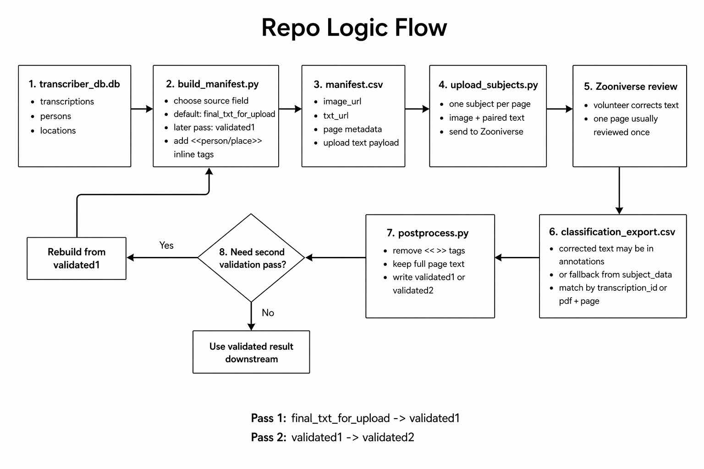

# USCT Pension Files Project

Architecture diagram: `assets/repo_logic_flow.jpg`

## Overview

This repo covers the upload and validation stage of the USCT Pension Files project. It takes page-level transcriptions from SQLite, sends them to Zooniverse for human correction, and writes validated text back into the database.


If you are approaching this as:

- a client or project partner, start with [CLIENT_README.md](CLIENT_README.md)
- a future student team member, start with this and [FUTURE_TEAMS_README.md](FUTURE_TEAMS_README.md)
- Dietrich Computing or a technical maintainer, start with [DIETRICH_COMPUTING_README.md](DIETRICH_COMPUTING_README.md)

## Main Components and logic



- `dataset/transcriber_db.db`
  SQLite database containing page-level transcriptions and extracted structured data.

- `src/upload/build_manifest.py`
  Generates the current Zooniverse manifest from the database using the S3 / CloudFront image setup.

- `src/upload/db_queries.py`
  Holds the SQLite query helpers used by the Zooniverse scripts.

- `src/upload/transcript_formatter.py`
  Contains the names/places formatting logic used to build the volunteer-facing text block.

- `src/upload/upload_subjects.py`
  Uploads page images and paired text files to Zooniverse using the `TextFromSubject` workflow.

- `src/upload/postprocess.py`
  Reads Zooniverse classification exports and writes cleaned validated text into `validated1` or `validated2`.

- `dataset/manifest.csv`
  Generated manifest used for Zooniverse upload.

## Current Workflow

1. Page-level transcription text is stored in `transcriptions`.
2. Extracted people and places are stored in `persons` and `locations`.
3. `src/upload/build_manifest.py` creates `dataset/manifest.csv`.
4. `src/upload/upload_subjects.py` uploads one subject per page to Zooniverse.
5. Volunteers correct the text in Zooniverse.
6. `src/upload/postprocess.py` removes `<<...>>` tags and stores the cleaned page text in `validated1` or `validated2`.

## Key Documents

- [CLIENT_README.md](CLIENT_README.md)
  Short client-facing explanation of the Zooniverse stage.

- [FUTURE_TEAMS_README.md](FUTURE_TEAMS_README.md)
  Student-oriented handoff focused on the Zooniverse component in the context of the larger project.

- [DIETRICH_COMPUTING_README.md](DIETRICH_COMPUTING_README.md)
  Technical implementation details and the two-pass validation workflow.

- [STUDENT_TEAM_README.md](STUDENT_TEAM_README.md)
  Broader dataset and project background for student researchers.

- [ZOONIVERSE_SETUP_CHECKLIST.md](ZOONIVERSE_SETUP_CHECKLIST.md)
  Manual post-upload checklist for verifying the Zooniverse setup.

## Running the Current Zooniverse Pipeline

Generate the manifest:

```powershell
python src\upload\build_manifest.py
```

Set Zooniverse credentials and a subject set name:

```powershell
$env:ZOONIVERSE_USERNAME="your-zooniverse-username"
$env:ZOONIVERSE_PASSWORD="your-zooniverse-password"
$env:ZOONIVERSE_PROJECT_ID="32086"
$env:SUBJECT_SET_NAME="TextFromSubject Test"
```

Upload to Zooniverse:

```powershell
python src\upload\upload_subjects.py
```

Post-process a Zooniverse classification export:

```powershell
$env:EXPORT_FILE="dataset/classification_export.csv"
$env:VALIDATED_OUTPUT_COLUMN="validated1"
python src\upload\postprocess.py
```

For a second pass, rebuild from `validated1` and write the next export into `validated2`:

```powershell
$env:TRANSCRIPT_SOURCE_FIELD="validated1"
python src\upload\build_manifest.py

$env:VALIDATED_OUTPUT_COLUMN="validated2"
python src\upload\postprocess.py
```

## Important Notes

- The current upload flow assumes the Zooniverse project is configured with the `TextFromSubject` task type.
- Images are served from CloudFront rather than uploaded from a local image directory.
- The manifest file is `dataset/manifest.csv`.
- `build_manifest.py` can now upload from a configurable source column using `TRANSCRIPT_SOURCE_FIELD`.
- `postprocess.py` can now write cleaned full-page text into configurable columns such as `validated1` and `validated2`.
- The DB access layer for the current Zooniverse workflow is split into `src/upload/db_queries.py`.
- If you change the manifest text format, existing Zooniverse subject sets will not update automatically.
